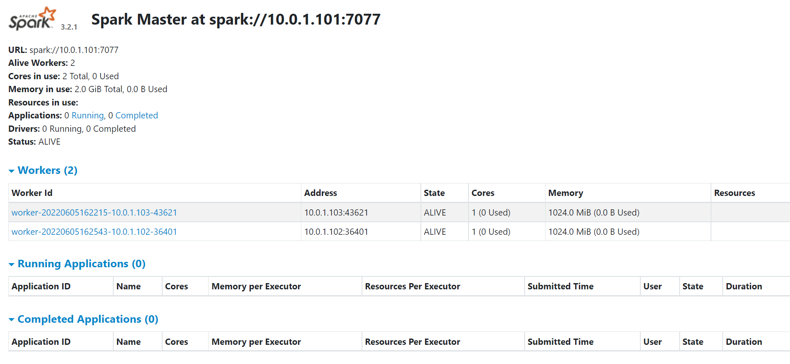
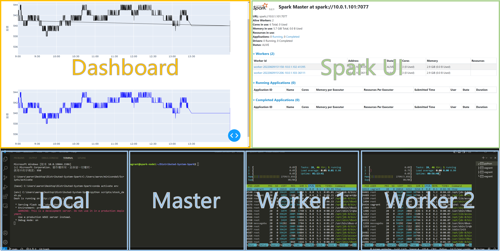

# Distributed-System-Spark
本專案將以Spark的MLlib設計爬蟲資料缺失自動補救機制，基本流程我們透過FinMind API爬取每日股票，將資料存入Influx Database，再以Plotly API 和 Dash API進行資料視覺化；當爬蟲部分出現錯誤而無法依序取得資料時，系統將自動呼叫Spark的MLlib API，此時MLlib會存取Database的資料並進行預測，再將預測結果寫回Database，以下為我們整體專案的介紹和相關程式的安裝流程。
## Introduction

### Stock Data Crawler

### InfluxDB

### Spark Cluster & Regression Prediction
#### Regression prediction
- 程式碼為spark_predict.py，程式是以pyspark為基礎撰寫，由五個自訂函數組成，函數分別為:
  - get_args():用來取得預設參數，包括資料缺失的日期、時間及要預測的筆數、訓練模型所需的特徵數，而特徵則為近三筆的價格。

  - get_data():從influxdb撈取目前時點最近20筆(data_num*2)的資料，在20筆資料中篩選出早於缺失資料的時間的近10筆資料。由於我們要預測的是股價，屬於時間序列資料，因此透過一連串資料處理，產生sliding window的資料集，作為訓練預測模型的資料。

  - predict_price():輸入get_data產生資料集，製成dataframe，以T(當前close)作為label，近三筆的價格作為features，透過pipeline進行資料處理及訓練，訓練模型為Linear Regression，經過訓練後預測缺失資料時間的價格，將預測結果處存成json格式，並判斷預測結果是否有正確產生，若無則輸出False狀態。

  - write_data():輸入predict_price()產生的預測結果與狀態，若狀態為True，則將預測結果寫回db的prediction_data表，否則，只印出失敗訊息不做任何動作。

  - main():依序執行將前述的四大功能，並印出各階段所花時間。

### Visual Design

## Dev Environment
### Spark cluster(VM - Ubuntu)
1. 先安裝好 [Vagrant](https://www.vagrantup.com/) 、 [git](https://git-scm.com/) 、[git-lfs](https://git-lfs.github.com/)

2. 執行下列命令:
```shell
git clone https://github.com/C-WeiYu/Distributed-System-Spark.git
cd Distributed-System-Spark
```
3. 透過 `Vagrantfile` 建立 spark cluster VM。(可以更改 `Vagrantfile` 的 num_nodes 設定總共要建立幾個工作節點)
```shell
vagrant up
```

4. 進入到 master 節點的 VM，啟動 master 節點。 (預設 spark-node1 為 master)
```shell
vagrant ssh spark-node1
```
```shell
sudo $SPARK_HOME/sbin/start-master.sh
```

5. 依序進入到 worker 節點的 VM，下面以 spark-node2 為例。 (預設 spark-node2、spark-node... 為 worker)

```shell
vagrant ssh spark-node2
```
```shell
sudo $SPARK_HOME/sbin/start-worker.sh spark://$MASTERIP:7077
```
6. 可以到 local 的電腦，進到 http://10.0.1.101:8080/ 去監控 VM 中的 Spark cluster。(10.0.1.101 為 master-node IP)



7. 在 master 安裝所需的 python 套件。

```shell
cd Distributed-System-Spark
sudo pip3 install -r requirements.txt
```

### InfluxDB(AWS)(Win10)
1. 打開Windows PowerShell，貼上以下連結，安裝influxdb
```shell
wget https://dl.influxdata.com/influxdb/releases/influxdb-1.8.6_windows_amd64.zip -UseBasicParsing -OutFile influxdb-1.8.6_windows_amd64.zip
Expand-Archive .\influxdb-1.8.6_windows_amd64.zip -DestinationPath 'C:\Program Files\InfluxData\influxdb\'
```

2. 修改C:\Program Files\InfluxData\influxdb\influxdb-1.8.6-1(預設路徑)底下的influxdb.conf
```shell
(45行、48行) 可修改預設檔案夾路徑 
(251行) enabled = true
(260行) bind-address = ":8086"
```

3. 安裝NSSM，並執行
```shell
nssm.exe install
```
```shell
Path的路徑為influxd.exe的檔案位置
Arguments的路徑為influxdb.conf的檔案位置
```

4. 在nssm/win64的目錄下，執行
```shell
sc start (Service name)
```

5. 在C:\Program Files\InfluxData\influxdb\influxdb-1.8.6-1(預設路徑)執行以下指令，啟動InfluxDB Server
```shell
influxd.exe --config influxdb.conf
```

6. 在aws控制台的安全設定中，對外開放8086 port

7. 在Windows防火牆的進階設定中，對外開放8086 port


### Local computer(Win10)
1. 建立乾淨的 python 環境。(conda 為例也可以使用 virtualenv)
```shell
conda create --name env python=3.6
conda activate env
```

2. 安裝需要的套件。
```shell
pip install -r requirements.txt
```

### Version info 
|軟體|版本|網址|備註|
|:-:|-|-|-|
|JAVA| JDK8(linux、x86 64bit)| [OpenLogic’s OpenJDK Downloads](https://www.openlogic.com/openjdk-downloads?field_java_parent_version_target_id=416&field_operating_system_target_id=426&field_architecture_target_id=391&field_java_package_target_id=396) | 可使用: Java 8/11, Scala 2.12/2.13|
|Spark| 3.2.1(hadoop3.2) | [Downloads \| Apache Spark](https://spark.apache.org/downloads.html) ||
|Python| 3.6.9 |||
|Vagrant| 2.2.19 | [Vagrant by HashiCorp (vagrantup.com)](https://www.vagrantup.com/) | 需先自行安裝 |
|Ubuntu| Ubuntu 18.04.6 LTS (Bionic Beaver) | [Discover Vagrant Boxes - Vagrant Cloud (vagrantup.com)](https://app.vagrantup.com/boxes/search?utf8=%E2%9C%93&sort=downloads&provider=&q=ubuntu%2Fbionic64+) | 透過 vagrant 安裝 |
|InfluxDB||||

## Quick start
1. 在開始前，請確定設定好環境(看上一章 [Dev Environment](README.md#dev-environment))
2. 以下命令皆在 `Distributed-System-Spark` 資料夾底下運行
### Step1: 在 local 開啟視覺化 dashbord
```shell
python scripts/stock_dash.py
```
### Step2: DEMO 版面配置

- **Local**: 跑視覺化 dashboard，透過瀏覽器開啟。
- **Spark UI**: Spark 內建，監控 spark cluster 的狀態，master node 執行後就可以在 local 的瀏覽器透過 http://10.0.1.101:8080/
- **Master**: 主要節點，負責執行爬蟲程式和 pyspark 預測資料
- **Worker**: 工作節點，負責執行 master 派下來的工作，這邊使用 `htop` 開啟效能監控，可以呈現資源使用的狀態。

### Step3: master 的 VM 執行爬蟲程式
```shell
python3 scripts/crawler_version1.py
```
- 註: 因目標是爬取股市資料，9:00 -13:30 才會有資料

### Step4: 結束後記得關 VM
```shell
vagrant halt
```

## Demo
[](https://www.youtube.com/watch?v=76fHSBQzw_Y)

## reference
- Spark 叢集(Standalone Mode)
  - 官方說明
      - https://spark.apache.org/docs/latest/cluster-overview.html
      - https://spark.apache.org/docs/latest/spark-standalone.html
  - spark 叢集的設定
      - [How to Install Spark on Ubuntu {Instructional guide} (phoenixnap.com)](https://phoenixnap.com/kb/install-spark-on-ubuntu)
      - [Set up a local Spark cluster step by step in 10 minutes | by Andrew Zhu | CodeX | Medium](https://medium.com/codex/setup-a-spark-cluster-step-by-step-in-10-minutes-922c06f8e2b1)
  - vagrant 自動化部屬範例
      - [qzchenwl/vagrant-spark-cluster: Vagrantfile to setup 2-node spark cluster (github.com)](https://github.com/qzchenwl/vagrant-spark-cluster)
      - [02 setting up spark cluster with vagrant - 哔哩哔哩 (bilibili.com)](https://www.bilibili.com/read/cv10928420)
      - [vagrant学习笔记 - provision - Pekkle - 博客园 (cnblogs.com)](https://www.cnblogs.com/pekkle/p/9547111.html)
  - Ruby (vagrantfile)
    - [Ruby 程式語言入門 - Rails 實戰聖經 (ihower.tw)](https://ihower.tw/rails/ruby.html)
    - [Ruby 教程 | 菜鸟教程 (runoob.com)](https://www.runoob.com/ruby/ruby-tutorial.html)
  - Pyspark
    - [How to Spark Submit Python | PySpark File (.py)? - Spark by {Examples} (sparkbyexamples.com)](https://sparkbyexamples.com/pyspark/spark-submit-python-file/)
- 爬蟲


- influxdb

- 視覺化 Dashboard
    - plotly + Dash
      - [初學Pandas+Plotly+Dash大禮包](https://weilihmen.medium.com/%E5%88%9D%E5%AD%B8pandas-ploty-dash%E5%A4%A7%E7%A6%AE%E5%8C%85-8661c04e67b7)
## Contributors
|組員|系級|學號|工作分配|github|
|-|-|-|-|:-:|
|莊崴宇|資科碩一|110753117| 簡報、github | [C-WeiYu](https://github.com/C-WeiYu)|
|何彥南|資科碩一|110753202| Spark 叢集、github、Demo 影片| [aaron1aaron2](https://github.com/aaron1aaron2)|
|姚惠馨|資科碩一|110753135| Dashboard | [Hsin0705](https://github.com/Hsin0705)|
|吳仁凱|資科碩一|110753157| Pyspark(數據處理與分析)| [k0341055](https://github.com/k0341055)|
|張修誠|資科碩一|110753165| 爬蟲 | [juzowa](https://github.com/juzowa)|
|吳泓澈|資科碩一|107306009| InfluxDB | [Hunter107306009](https://github.com/Hunter107306009)|

